<div align="center">

[](https://twitter.com/sharang33)
[](https://linkedin.com/in/sharang-parnerkar)
[](https://github.com/mighty840)
[](https://github.com/mighty840)

</div>

---

## ⚡ The Pitch

```rust
struct Sharang {
    role:      &'static str,
    obsessed:  Vec<&'static str>,
    shipping:  Vec<Project>,
    philosophy: &'static str,
}

impl Sharang {
    fn new() -> Self {
        Self {
            role: "systems engineer · founder · firmware tinkerer",
            obsessed: vec![
                "Rust everywhere it fits (and a few places it doesn't)",
                "self-hosting the stack — Coolify, Gitea, SigNoz, LiteLLM",
                "AI agents that do real work, not demo work",
                "embedded firmware → cloud orchestration, end to end",
            ],
            shipping: vec![
                Project::Orchestrator,    // orca
                Project::FirmwareSDK,     // ferrite-sdk
                Project::RestaurantOS,    // kitchenasty
                Project::OpenDataAI,      // open-eyes
                Project::CampaignOps,     // politiktok
            ],
            philosophy: "own your infra, ship the weird stuff, measure everything",
        }
    }
}
```

---

## 🛠️ Arsenal

<div align="center">


</div>

---

## 🚀 Currently Shipping

<table>
<tr>
<td width="50%" valign="top">

### 🐋 [orca](https://github.com/mighty840/orca)
**Container + Wasm orchestrator with AI ops**
The gap between Coolify and Kubernetes. Rust-native, GPU-aware, self-healing.
`Rust` · `Wasm` · `gRPC`

</td>
<td width="50%" valign="top">

### 🦀 [ferrite-sdk](https://github.com/mighty840/ferrite-sdk)
**Embedded firmware observability for ARM Cortex-M**
Crashes, metrics, traces — zero alloc. Because `printf` debugging is a war crime.
`Rust` · `Embassy` · `RTIC` · `STM32`

</td>
</tr>
<tr>
<td width="50%" valign="top">

### 👁️ [open-eyes](https://github.com/mighty840/open-eyes)
**GenAI dashboard for German open government data**
Natural language → DuckDB → ECharts. Ask in plain English, get a chart.
`Rust` · `DuckDB` · `LLM`

</td>
<td width="50%" valign="top">

### 🍽️ [kitchenasty](https://github.com/mighty840/kitchenasty)
**Self-hosted restaurant OS** · ⭐ 20
Online ordering, table reservations, kitchen ops — one admin panel. No SaaS rent.
`TypeScript` · `Next.js` · `Postgres`

</td>
</tr>
<tr>
<td width="50%" valign="top">

### 🗳️ [politiktok](https://github.com/mighty840/politiktok)
**AI-powered campaign operations platform**
Because campaigns deserve better than spreadsheets and prayer.
`Rust` · `Leptos` · `LLM`

</td>
<td width="50%" valign="top">

### 💸 [etopay-sdk](https://github.com/ETOSPHERES-Labs/etopay-sdk)
**Multi-platform payment SDK** · ⭐ 5
Production SDK shipped at ETOSPHERES Labs. Mobile + web + native bindings.
`Rust` · `FFI` · `WASM`

</td>
</tr>
</table>

---

## 📊 The Numbers

<div align="center">


</div>

---

## 🐍 Contribution Snake

<div align="center">


</div>

---

## 🧭 Philosophy

> **Own your infrastructure.** Rented platforms give you velocity until they don't. Self-hosting is a moat.
>
> **Ship the weird stuff.** The interesting problems live where firmware, AI, and distributed systems meet.
>
> **Measure everything.** If it's not in SigNoz, it didn't happen.
>
> **Rust where it counts.** Memory safety isn't a feature, it's a baseline.

---

<div align="center">

**Currently:** building [orca](https://github.com/mighty840/orca) · firmware on STM32L4 · running a 3-channel music agent fleet

**Open to:** systems engineering roles · firmware contracts · AI infrastructure consulting

`always self-hosting · always measuring · always shipping`

</div>
